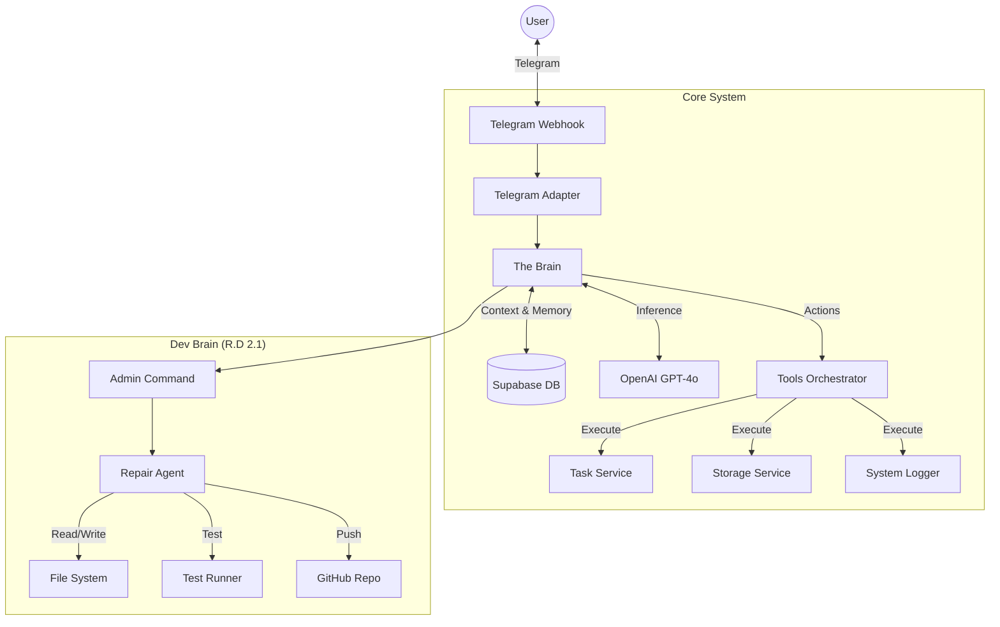

# How Doloris Works: System Architecture & Workflow

## 1. High-Level Overview

Doloris 2.0 is a **dual-brain AI system** designed to be both a personal assistant and a self-improving software engineer.

*   **User Brain (Doloris):** Handles daily tasks, chat, reminders, and personal data.
*   **Dev Brain (R.D 2.1):** A specialized autonomous agent that can read, test, and fix the system's own code.

The system is built on **FastAPI** (Python), uses **Supabase** (PostgreSQL) for memory, and runs on **Render**. It interfaces with the user via **Telegram**.

---

## 2. System Architecture

---

## 3. The Lifecycle of a Message

Here is exactly what happens when you send a message:

### Step 1: Ingestion
1.  **Telegram** sends a POST request to `https://doloris-2.onrender.com/telegram/webhook`.
2.  **`telegram_webhook.py`** receives the payload and generates a unique `trace_id`.
3.  **`TelegramAdapter`** extracts the text, user ID, and any file attachments.

### Step 2: The Brain (`app/core/brain.py`)
1.  **Context Building:** The Brain fetches:
    *   **User Profile** (name, timezone).
    *   **Active Instructions** (custom rules you've set).
    *   **Recent Conversation History** (last 10 messages).
    *   **System Logs** (recent errors or events).
2.  **Prompt Assembly:** It combines all this into a massive system prompt that defines Doloris's persona.
3.  **Inference:** It sends this context to **OpenAI (GPT-4o)** via the `OpenAIClient`.

### Step 3: Tool Execution (`app/core/tools_orchestrator.py`)
1.  If GPT-4o decides it needs to *do* something (e.g., "Save task"), it returns a **Tool Call**.
2.  The **`ToolsOrchestrator`** validates the request and routes it to the right function (e.g., `add_task`).
3.  The function executes (writing to Supabase) and returns a result string.
4.  **Recursion:** The result is sent *back* to GPT-4o so it can generate a final natural language response confirming the action.

### Step 4: Response
1.  The final text response is sent back to Telegram via `TelegramAdapter`.
2.  **Fallback:** If the message fails (e.g., markdown error), the adapter automatically retries in plain text.

---

## 4. Core Components

### 🧠 The Brain (`app/core/brain.py`)
The central controller. It doesn't "know" anything itself; it orchestrates the flow of information between the user, the database, and the LLM.

### 🛠️ Tools Orchestrator (`app/core/tools_orchestrator.py`)
The hands of the system. It exposes specific Python functions to the AI.
*   **Task Tools:** `add_task`, `list_tasks`, `complete_task`.
*   **Note Tools:** `create_log`, `update_instruction`.
*   **Dev Tools:** (Only accessible to R.D) `read_file`, `run_tests`, `create_pr`.

### 📡 OpenAI Client (`app/openai_client.py`)
The interface to intelligence.
*   **Old:** Used an experimental "Responses API" (caused 400 errors).
*   **New:** Uses standard **Chat Completions API** with full Tool Calling support.

### 📝 System Logger (`app/core/system_logger.py`)
The nervous system. It records every internal event (webhook received, intent detected, tool executed) to the `system_events` table. This allows us to "trace" exactly what happened during any interaction using the `/trace` command.

---

## 5. The Dev Brain (R.D 2.1)

R.D is a special mode triggered by commands like `/repair`. It is an **Agentic Loop**:

1.  **Diagnose:** It reads the `errors` table and recent logs.
2.  **Explore:** It uses `code_tools.py` to read the actual source code of the app.
3.  **Reproduce:** It writes a new test file (`tests/reproduce_issue.py`) to confirm the bug.
4.  **Patch:** It edits the code to fix the bug.
5.  **Verify:** It runs the test again to ensure it passes.
6.  **Deploy:** It uses `github_tools.py` to create a Pull Request with the fix.

---

## 6. Database Schema (Supabase)

*   `users`: Stores user preferences and Telegram IDs.
*   `tasks`: Your todo list items.
*   `instructions`: Custom rules for how Doloris should behave.
*   `logs`: Personal logs (mood, sleep, etc.).
*   `system_events`: Technical logs for debugging.
*   `errors`: Aggregated error tracking signatures.
*   `repair_tickets`: Tracks R.D's work on specific bugs.
